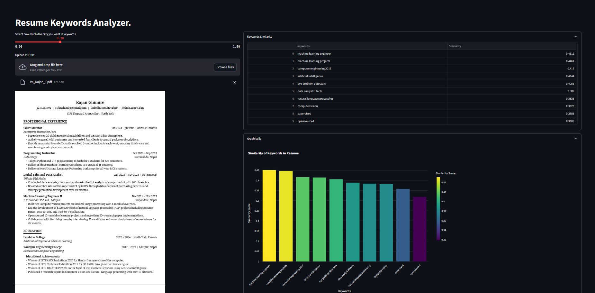

**Project Title**: Resume Keyword Diversity System



### Introduction
This project addresses the common issue in resume selection processes where significant, yet non-standard keywords are overlooked due to traditional keyword matching algorithms. By integrating a diversity parameter, our system encourages a more holistic and inclusive approach to understanding the contents of a resume.

### Features
- **Diversity Parameter**: Adjust the scope of keyword analysis to either broaden or narrow the focus.
- **Interactive Visualization**: Use Plotly to visualize the similarity and diversity of resume keywords.
- **Customizable Analysis**: Configure the system to match the specific needs of different recruiting contexts.

### Installation
Provide step-by-step instructions on setting up the project:
```bash
git clone https://github.com/R4j4n/ResumeProcessor.git
cd resume-keyword-diversity
pip install -r requirements.txt
```

### Usage
Guide users on how to use the system, including running scripts or using the interface:
```python
streamlit run ui.py
```

### Contributing
Encourage others to contribute to your project by detailing the process:
1. Fork the repo.
2. Create your feature branch (`git checkout -b feature/AmazingFeature`).
3. Commit your changes (`git commit -m 'Add some AmazingFeature'`).
4. Push to the branch (`git push origin feature/AmazingFeature`).
5. Open a new Pull Request.

### License
State the license under which your project is made available. For example:
```
Distributed under the MIT License. See `LICENSE` for more information.
```

